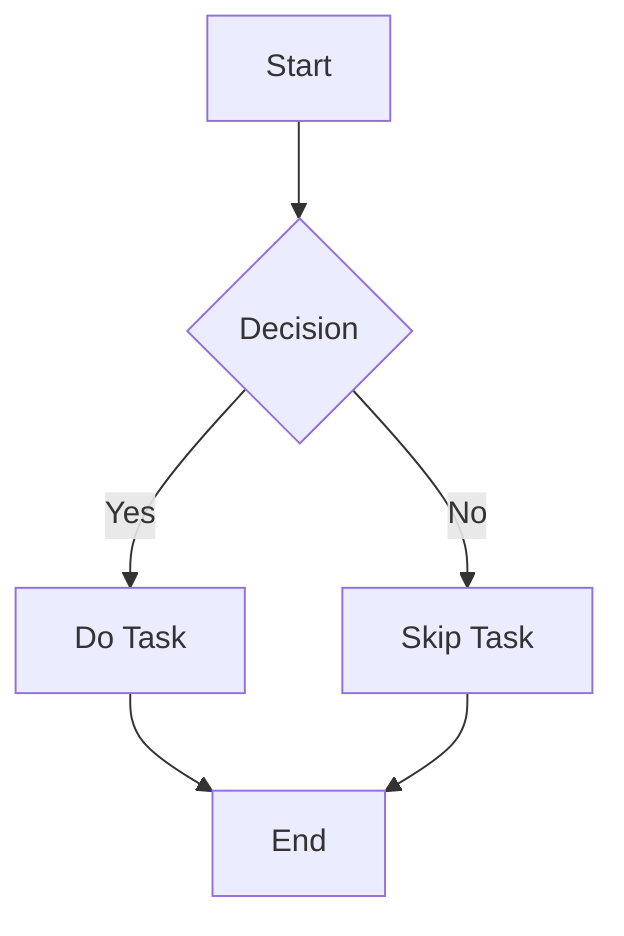

# IVYSTUDY Renderer Showcase 🎉

Welcome to the **IVYSTUDY Renderer Showcase**! This document demonstrates the full range of features supported by the renderer, including **Markdown rendering**, **Mermaid diagrams**, **Chart.js graphs**, **LaTeX math**, and more. Let's explore!

---

## 📊 Chart.js Example

Here is a bar chart created using **Chart.js**:

```chart
{
    "type": "bar",
    "data": {
        "labels": ["Red", "Blue", "Yellow", "Green", "Purple", "Orange"],
        "datasets": [{
            "label": "Votes",
            "data": [12, 19, 3, 5, 2, 3],
            "backgroundColor": [
                "rgba(255, 99, 132, 0.2)",
                "rgba(54, 162, 235, 0.2)",
                "rgba(255, 206, 86, 0.2)",
                "rgba(75, 192, 192, 0.2)",
                "rgba(153, 102, 255, 0.2)",
                "rgba(255, 159, 64, 0.2)"
            ],
            "borderColor": [
                "rgba(255, 99, 132, 1)",
                "rgba(54, 162, 235, 1)",
                "rgba(255, 206, 86, 1)",
                "rgba(75, 192, 192, 1)",
                "rgba(153, 102, 255, 1)",
                "rgba(255, 159, 64, 1)"
            ],
            "borderWidth": 1
        }]
    },
    "options": {
        "scales": {
            "y": {
                "beginAtZero": true
            }
        }
    }
}
```

---

## 🛠️ Mermaid.js Diagrams

Here’s a **Mermaid.js** flowchart:



---

## 🧮 LaTeX Math Rendering

Display complex mathematical equations with **KaTeX**:

Inline equation: $E = mc^2$

Block equation:

$$
\int_{a}^{b} x^2 \, dx = \frac{b^3}{3} - \frac{a^3}{3}
$$

---

## ✨ Markdown Styling

### Headings

#### H4 Heading
##### H5 Heading
###### H6 Heading

---

### Lists

- Bullet list item 1
- Bullet list item 2
  - Nested item 1
  - Nested item 2

1. Ordered list item 1
2. Ordered list item 2

---

### Blockquotes

> "The only limit to our realization of tomorrow is our doubts of today." – Franklin D. Roosevelt

---

### Code Blocks

```javascript
function greet(name) {
    console.log(`Hello, ${name}!`);
}
greet("IVYSTUDY");
```

---

## ✅ Task Lists

- [x] Learn Markdown
- [x] Explore IVYSTUDY
- [ ] Build something amazing

---

## 📚 Containers

### Info Container

::: info
This is an informational message.
:::

### Warning Container

::: warning
This is a warning message. Proceed with caution!
:::

### Success Container

::: success
Congratulations! You’ve successfully completed this section.
:::

---

## 🔍 Search and Filter

Use the search bar to find lessons, topics, or subjects. Try searching for **"Math"** or **"Physics"**.

---

## 🎨 Dark Mode

Switch between **light mode** and **dark mode** to suit your preference. 🌞🌙

---

## 🖼️ Images


---

## 📅 Interactive Features

Click the **Reveal Solution** button below to see the answer:

[reveal]
**Solution:** The answer is **42**.
[/reveal]

---

## 📈 Sorting and Filtering

Sort lessons by **newest**, **oldest**, **duration**, or **topic**. Use the subject pills to filter by category.

---

## 🖋️ Table of Contents

This document automatically generates a **Table of Contents** for easy navigation.

---

## 🎉 Thank You!

Thank you for exploring the **IVYSTUDY Renderer Showcase**. We hope you enjoy using the platform!
