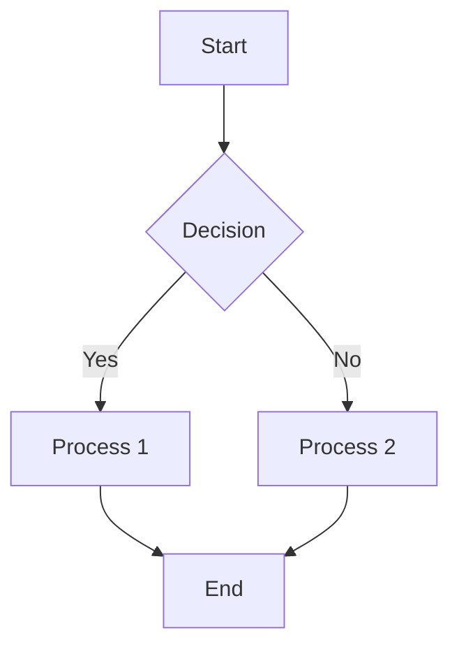

# Renderer Showcase
This document demonstrates all supported rendering features.

## Basic Markdown
**Bold text**, *italic text*, and `inline code`

### Lists
1. Ordered list
2. With numbers
   * Unordered sublist
   * With bullets

### Task Lists
- [x] Completed task
- [ ] Pending task

### Tables
| Feature | Support | Notes |
|---------|---------|-------|
| Mermaid | ✅ | Diagrams |
| Chart.js | ✅ | Graphs |
| LaTeX | ✅ | Math |

## Extended Features

### Mermaid Diagrams


### Chart.js Graphs
```chart
{
    type: 'bar',
    data: {
        labels: ['A', 'B', 'C'],
        datasets: [{
            label: 'Sample Data',
            data: [10, 20, 30],
            backgroundColor: ['#ff6384', '#36a2eb', '#cc65fe']
        }]
    }
}
```

### Mathematical Equations (LaTeX)
Inline math: $E = mc^2$

Display math:
$$
\int_{-\infty}^{\infty} e^{-x^2} dx = \sqrt{\pi}
$$

### PGFPlots
```pgfplots
\begin{axis}[
    xlabel=$x$,
    ylabel=$y$
]
\addplot[color=blue]{x^2};
\addplot[color=red]{x^3};
\end{axis}
```

### TikZ Diagrams
```tikz
\draw[thick,rounded corners=8pt] (0,0) -- (0,2) -- (1,3.25) -- (2,2) -- (2,0) -- (0,2) -- (2,2) -- (0,0) -- (2,0);
```

### Asymptote Graphics
```asy
size(200,200);
path unitcircle = Circle((0,0),1);
fill(unitcircle,pink);
draw(unitcircle);
dot((0,0));
```

### MATLAB Plots
```matlab
x = linspace(0,2*pi,100);
y = sin(x);
plot(x,y,'LineWidth',2);
xlabel('x');
ylabel('sin(x)');
title('Sine Wave');
grid on;
```

### Interactive Elements
[reveal]
This is hidden content that can be revealed by clicking!
[/reveal]

### Custom Containers
::: info
This is an info box
:::

::: warning
This is a warning box
:::

::: success
This is a success box
:::

### Code Highlighting
```python
def hello_world():
    print("Hello, world!")
    return True
```

### Advanced LaTeX Examples
Maxwell's Equations:
$$
\begin{aligned}
\nabla \cdot \mathbf{E} &= \frac{\rho}{\varepsilon_0} \\
\nabla \cdot \mathbf{B} &= 0 \\
\nabla \times \mathbf{E} &= -\frac{\partial \mathbf{B}}{\partial t} \\
\nabla \times \mathbf{B} &= \mu_0\left(\mathbf{J} + \varepsilon_0\frac{\partial \mathbf{E}}{\partial t}\right)
\end{aligned}
$$

### Combined Example
Here's a mathematical model with visualization:

$$
f(x) = \sin(x) \cdot e^{-x/10}
$$

```chart
{
    type: 'line',
    data: {
        labels: ['0','π/2','π','3π/2','2π'],
        datasets: [{
            label: 'Damped Sine Wave',
            data: [0, 0.59, 0.27, 0.08, 0.02],
            borderColor: '#36a2eb'
        }]
    }
}
```

### Dark Mode Compatible
All diagrams and charts automatically adjust to dark mode when enabled.
