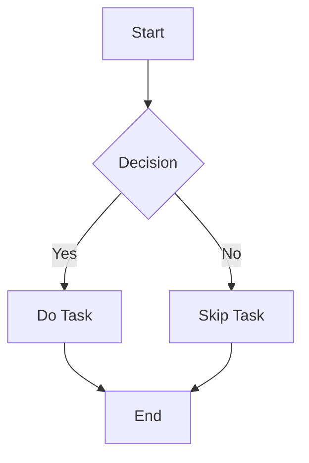

# IVYSTUDY Renderer Showcase 

---

## Chart.js Example

Here is a bar chart created using **Chart.js**:

```chart
{
    "type": "bar",
    "data": {
        "labels": ["Red", "Blue", "Yellow", "Green", "Purple", "Orange"],
        "datasets": [{
            "label": "Votes",
            "data": [12, 19, 3, 5, 2, 3],
            "backgroundColor": [
                "rgba(255, 99, 132, 0.2)",
                "rgba(54, 162, 235, 0.2)",
                "rgba(255, 206, 86, 0.2)",
                "rgba(75, 192, 192, 0.2)",
                "rgba(153, 102, 255, 0.2)",
                "rgba(255, 159, 64, 0.2)"
            ],
            "borderColor": [
                "rgba(255, 99, 132, 1)",
                "rgba(54, 162, 235, 1)",
                "rgba(255, 206, 86, 1)",
                "rgba(75, 192, 192, 1)",
                "rgba(153, 102, 255, 1)",
                "rgba(255, 159, 64, 1)"
            ],
            "borderWidth": 1
        }]
    },
    "options": {
        "scales": {
            "y": {
                "beginAtZero": true
            }
        }
    }
}
```

---

## Mermaid.js Diagrams

Here’s a **Mermaid.js** flowchart:


```desmos
y = x^2
y = x^2a
a = 0
y = \sin(x)
```
---

## LaTeX Math Rendering

Display complex mathematical equations with **KaTeX**:

Inline equation: $E = mc^2$

Block equation:

$$
\int_{a}^{b} x^2 \, dx = \frac{b^3}{3} - \frac{a^3}{3}
$$


---
### Lists
---
- Bullet list item 1
- Bullet list item 2
  - Nested item 1
  - Nested item 2

1. Ordered list item 1
2. Ordered list item 2


---
### Blockquotes
---
> "The only limit to our realization of tomorrow is our doubts of today." – Franklin D. Roosevelt


---
### Code Blocks
---
```javascript
function greet(name) {
    console.log(`Hello, ${name}!`);
}
greet("IVYSTUDY");
```
---
### Tables
---
| Left-aligned | Center-aligned | Right-aligned |
|:-------------|:-------------:|-------------:|
| Left         | Center        | Right        |
| Left         | Center        | Right        |

---
### Markschemes
---
<details>
<summary>Markscheme</summary>
---

| Second Test | Center-aligned | Right-aligned |
|-------------|-------------|-------------|
| 1         | 3        | 5        |
| 2         | 4        | 6        |


## Chart.js Example

Here is a bar chart created using **Chart.js**:

```chart
{
    "type": "bar",
    "data": {
        "labels": ["Red", "Blue", "Yellow", "Green", "Purple", "Orange"],
        "datasets": [{
            "label": "Votes",
            "data": [12, 19, 3, 5, 2, 3],
            "backgroundColor": [
                "rgba(255, 99, 132, 0.2)",
                "rgba(54, 162, 235, 0.2)",
                "rgba(255, 206, 86, 0.2)",
                "rgba(75, 192, 192, 0.2)",
                "rgba(153, 102, 255, 0.2)",
                "rgba(255, 159, 64, 0.2)"
            ],
            "borderColor": [
                "rgba(255, 99, 132, 1)",
                "rgba(54, 162, 235, 1)",
                "rgba(255, 206, 86, 1)",
                "rgba(75, 192, 192, 1)",
                "rgba(153, 102, 255, 1)",
                "rgba(255, 159, 64, 1)"
            ],
            "borderWidth": 1
        }]
    },
    "options": {
        "scales": {
            "y": {
                "beginAtZero": true
            }
        }
    }
}
```

---

## Mermaid.js Diagrams

Here’s a **Mermaid.js** flowchart:


</details>
