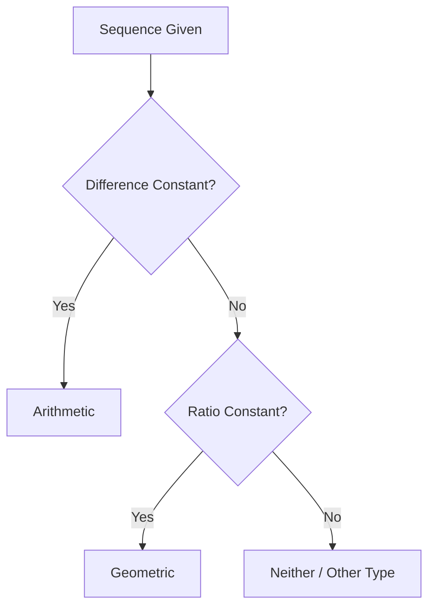

# 1.1 Arithmetic & Geometric Sequences and Series

## Objectives
- Define and classify arithmetic vs geometric sequences.
- Derive and apply formulas for general term and partial sums.
- Determine convergence of infinite geometric series ($|r|<1$) and compute their sums.
- Translate patterns into sigma notation and manipulate sums.
- Model real situations (finance, depreciation, growth) with appropriate sequence/series types.

## Prerequisites
- Basic algebra: rearranging formulas, factoring.
- Familiarity with powers and fractions.
- Understanding of pattern recognition and function notation.

## Concept Overview
Sequences list numbers in order. A series is the sum of terms of a sequence. Arithmetic growth is linear (add a constant each step) while geometric growth is multiplicative (multiply by a constant each step). Recognizing which pattern you have leads directly to the correct formula and modelling approach.

## Core Definitions & Formulas
| Type | Defining Property | General Term $a_n$ | Finite Sum $S_n$ | Infinite Sum $S_\infty$ Condition |
|------|-------------------|--------------------|------------------|--------------------------------------|
| Arithmetic | $a_{n}-a_{n-1}=d$ | $a_n = a_1 + (n-1)d$ | $S_n = \dfrac{n}{2}\big(2a_1+(n-1)d\big)$ | N/A |
| Geometric | $\dfrac{a_n}{a_{n-1}}=r$ ( $r\neq 0$ ) | $a_n = a_1 r^{n-1}$ | $S_n = a_1 \dfrac{1-r^{n}}{1-r}$ ($r\neq 1$) | $S_\infty = \dfrac{a_1}{1-r}$ if $|r|<1$ |

Sigma notation: $\displaystyle \sum_{k=m}^{n} f(k)$ represents $f(m)+f(m+1)+\cdots+f(n)$.

## Derivations / Proof Sketches
### Arithmetic Sum Formula
Consider first and last term pairing:
$$S_n = a_1 + (a_1+d) + (a_1+2d)+\dots + (a_1+(n-1)d)$$
Write reversed:
$$S_n = (a_1+(n-1)d) + (a_1+(n-2)d)+\dots + a_1$$
Add termwise: $2S_n = n(2a_1+(n-1)d)$ so $S_n = \dfrac{n}{2}(2a_1+(n-1)d)$.

### Geometric Sum Formula
Let $S_n = a_1 + a_1 r + a_1 r^2 + \dots + a_1 r^{n-1}$ (with $r\neq 1$). Multiply by $r$:
$$r S_n = a_1 r + a_1 r^2 + \dots + a_1 r^{n}$$
Subtract: $S_n - r S_n = a_1 - a_1 r^{n}$ ⇒ $S_n (1-r) = a_1 (1-r^{n})$ ⇒ $S_n = a_1 \dfrac{1-r^{n}}{1-r}$.

### Convergence of Infinite Geometric Series
If $|r|<1$ then $r^{n} \to 0$ as $n\to \infty$ so $S_n \to a_1/(1-r)$. If $|r|\ge 1$ terms do not shrink to zero ⇒ divergence.

<details>
<summary>Optional: Rigorous Limit Justification</summary>

Given $S_n = a_1 (1-r^{n})/(1-r)$ and $|r|<1$, for any $\varepsilon>0$ choose $N$ with $|r|^{N} < \varepsilon (1-|r|)/|a_1|$. Then for $n\ge N$:
$$|S_n - a_1/(1-r)| = \frac{|a_1||r|^{n}}{|1-r|} < \varepsilon.$$
Thus $S_n$ converges to $a_1/(1-r)$.

</details>

## Visual Intuition
### Arithmetic vs Geometric Growth (Early Terms)
```chart
{
	"type": "line",
	"data": {
		"labels": ["1","2","3","4","5","6","7","8"],
		"datasets": [
			{
				"label": "Arithmetic (a1=2,d=3)",
				"data": [2,5,8,11,14,17,20,23],
				"borderColor": "rgb(33,150,243)",
				"tension": 0.15
			},
			{
				"label": "Geometric (a1=2,r=1.5)",
				"data": [2,3,4.5,6.75,10.125,15.1875,22.7813,34.1719],
				"borderColor": "rgb(233,30,99)",
				"tension": 0.15
			}
		]
	},
	"options": {
		"plugins": { "title": { "display": true, "text": "Linear vs Multiplicative Growth" } },
		"scales": { "y": { "beginAtZero": true } }
	}
}
```

### Classification Flow


### Infinite Sum Convergence (Vary r)
```desmos
//config: {"bounds":{"x":[0,20],"y":[0,10]}, "grid": true, "expressions": true}
// Partial sums S_n = a(1-r^n)/(1-r) with a=3
a=3
r=0.6
S_n(n)=a*(1-r^n)/(1-r)
// Plot discrete points for n=1..20 conceptually (not actual discrete mode here)
```

## Worked Examples
### Example 1: 25th Term (Arithmetic)
An arithmetic sequence has $a_1=7$ and $d=-2$. Find $a_{25}$.  
Solution: $a_{25}=7+(25-1)(-2)=7-48=-41$.

### Example 2: Sum of First 50 Terms
Same sequence as Example 1. $S_{50} = \dfrac{50}{2}(2\cdot 7 + 49(-2)) = 25(14-98)=25(-84)=-2100$.

### Example 3: Infinite Geometric Series
Given $a_1=5$, $r=0.8$. Compute $S_\infty$.  
$S_\infty = 5/(1-0.8)=25$.

### Example 4: Sigma Translation
Write $3+7+11+\dots+ (4n-1)$ (n terms) in sigma notation: $\sum_{k=1}^{n} (4k-1)$.

### Example 5: Identify Type
Sequence: $2,6,18,54,\dots$ ⇒ ratio $3$ ⇒ geometric. $a_n = 2\cdot 3^{n-1}$.

### Example 6: Application – Savings Plan
Deposit $200$ monthly increasing by $10$ each month (arithmetic deposits) for 12 months. Total contributed = arithmetic sum with $a_1=200$, $d=10$: $S_{12}=6(2\cdot200+11\cdot10)=6(400+110)=6\cdot510=3060$.

## Common Mistakes & Tips
- Using infinite sum formula when $|r|\ge 1$.
- Mixing up $d$ and $r$.
- Forgetting that arithmetic difference can be negative.
- Writing $a_n = a_1 + nd$ instead of $a_1 + (n-1)d$.
- Not checking $r\neq 1$ before applying finite geometric sum formula (though formula algebraically still simplifies if handled carefully).

## Practice Set
### Core
1. Arithmetic: $a_1=4$, $d=5$. Find $a_{15}$.
2. Arithmetic: Find $n$ if $a_n=54$ in sequence $7,11,15,\dots$.
3. Geometric: $a_1=9$, $r=\tfrac{2}{3}$. Find $a_{8}$.
4. Geometric: Compute $S_{6}$ for $a_1=5$, $r=2$.
5. Infinite geometric: $a_1=12$, $r=0.25$. Find sum.
6. Write $5+8+11+\dots+ (3n+2)$ as sigma.
7. Determine if $1,2,4,7,11,16,\dots$ is arithmetic/geometric/other and justify.

### Challenge
8. Given arithmetic $a_p=20$, $a_q=50$ with $p<q$. Express $d$ and $a_1$ in terms of $p,q$.
9. Find number of terms in arithmetic series with $a_1=13$, $d=4$ whose sum is $1000$ (if any).
10. Geometric sequence has $a_3=45$, $a_6=1215$. Find $a_1$ and $r$.
11. For geometric series $S_\infty=40$ and $a_1=5$, find $r$ and $S_{5}$.
12. Show $\sum_{k=0}^{n-1} 2^k = 2^{n}-1$ using geometric formula.

### Extension
13. Mixed sequence defined by $b_n = 3n + 2^n$. Express $\sum_{n=1}^{m} b_n$ in closed form (separate parts).
14. Suppose $S_n$ (geometric) and $T_n$ (arithmetic) satisfy $S_n=T_n$ for $n=1,2,3$. Show sequences identical for all $n$ only if $r=1$ or $d=0$ (degenerate case). Explain.
15. Derive formula for $\sum_{k=1}^{n} k r^{k-1}$ (hint: differentiate geometric sum in $r$ or use manipulation).

<details>
<summary>Markscheme (Core)</summary>

---
1. $a_{15}=4+(15-1)5=74$.
2. $a_n=7+(n-1)4=54 \Rightarrow (n-1)4=47 \Rightarrow n=\dfrac{47}{4}+1$ (not integer ⇒ 54 not a term).
3. $a_8=9 (2/3)^{7}=9 \cdot 128/2187 = 1152/2187$ (simplify if desired).
4. $S_6=5(1-2^6)/(1-2)=5(1-64)/(-1)=315$.
5. $S_\infty=12/(1-0.25)=16$.
6. $\sum_{k=1}^{n} (3k+2)$.
7. Differences: $1,2,3,4,5,\dots$ not constant; ratios not constant ⇒ neither.

</details>

<details>
<summary>Markscheme (Challenge)</summary>

---
8. $a_p=a_1+(p-1)d=20$, $a_q=a_1+(q-1)d=50$ ⇒ subtract: $(q-p)d=30$ ⇒ $d=30/(q-p)$; then $a_1=20-(p-1)d$.
9. $S_n=\frac{n}{2}(2\cdot13+(n-1)4)=\frac{n}{2}(26+4n-4)=\frac{n}{2}(4n+22)=2n^2+11n=1000$ ⇒ $2n^2+11n-1000=0$ discriminant $=121+8000=8121$ not perfect square ⇒ no integer $n$.
10. $a_3=a_1 r^{2}=45$, $a_6=a_1 r^{5}=1215$ ⇒ divide: $r^{3}=27$ ⇒ $r=3$ ⇒ $a_1=45/9=5$.
11. $40=5/(1-r)$ ⇒ $1-r=1/8$ ⇒ $r=7/8$; $S_5=5(1-(7/8)^5)/(1-7/8)$.
12. Standard geometric sum with $a_1=1$, $r=2$.

</details>

<details>
<summary>Markscheme (Extension)</summary>

---
13. $\sum (3n) = 3\frac{m(m+1)}{2}$; $\sum 2^{n} = 2(2^{m}-1)$ (if starting at $n=1$). Combine: $\frac{3m(m+1)}{2} + 2(2^{m}-1)$.
14. Matching first three terms gives: arithmetic: $a, a+d, a+2d$; geometric: $g, gr, gr^{2}$. System implies $\frac{a+2d - (a+d)}{a+d - a} = 1 = r$ unless $d=0$. If $r=1$ geometric constant; if $d=0$ arithmetic constant. Hence only degenerate equality.
15. Known identity: $\sum_{k=1}^{n} k r^{k-1} = \frac{1 - (n+1)r^{n} + nr^{n+1}}{(1-r)^2}$ ($r\neq 1$). Derivation: Differentiate $\sum_{k=0}^{n} r^{k} = (1-r^{n+1})/(1-r)$ with respect to $r$ and adjust indices.

</details>

## Applications / Modelling
- Finance: compound interest $A=P(1+r)^n$ (geometric) vs linear saving plan (arithmetic deposits).
- Depreciation: value after $n$ periods $V=V_0 (1-d)^n$.
- Physics: repeated attenuation / decay processes.
- Computing: loop cost summations (geometric for doubling processes, arithmetic for linear increments).

## Extension / HL Enrichment
- Derive formula for $\sum_{k=1}^{n} k r^{k}$ using manipulation of geometric sums.
- Explore second-order linear recurrences producing arithmetic/geometric components.
- Investigate when sum of an arithmetic and a geometric sequence itself satisfies a recurrence of order 2.

## Summary & Key Takeaways
- Arithmetic = add constant difference $d$ ⇒ linear growth.
- Geometric = multiply by constant ratio $r$ ⇒ exponential growth.
- Finite sums have closed forms enabling fast computation.
- Infinite geometric series converge only for $|r|<1$.
- Sigma notation provides concise representation and enables algebraic manipulation.

## Quick Reference
| Sequence | $a_n$ | $S_n$ | Condition | $S_\infty$ |
|----------|-------|-------|-----------|-------------|
| Arithmetic | $a_1+(n-1)d$ | $\dfrac{n}{2}(2a_1+(n-1)d)$ | — | — |
| Geometric | $a_1 r^{n-1}$ | $a_1 \dfrac{1-r^{n}}{1-r}$ ($r\ne 1$) | $|r|<1$ | $\dfrac{a_1}{1-r}$ |

## Metadata
Topic Code: M1.1  
Level: SL/HL  
Tags: sequences, series, arithmetic, geometric, sigma, convergence  
Dependencies: none  

