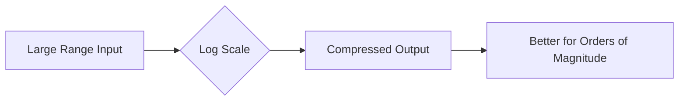

# 1.2 Exponents and Logarithms

## Objectives
- Apply and justify exponent laws (including negative & fractional exponents).
- Interpret logarithms as inverses of exponentials.
- Use logarithmic laws to simplify expressions and solve equations.
- Apply change-of-base formula for evaluation and proof contexts.
- Model growth/decay phenomena and interpret parameters.

## Prerequisites
- Laws of indices for integers.
- Basic function concept (input → output).
- Familiarity with solving simple equations.

## Concept Overview
Exponentials model repeated multiplication; logarithms answer: “Which exponent gives this result?” They are inverse functions: if $y=a^{x}$ then $x=\log_a y$. Natural logarithms ($\ln$) link cleanly with calculus (derivatives/integrals), while base 10 logs relate to orders of magnitude.

## Core Definitions & Formulas
| Concept | Statement | Conditions |
|---------|-----------|------------|
| Exponential | $a^0=1$, $a^{-n}=1/a^{n}$ | $a\ne 0$ |
| Product | $a^{m} a^{n} = a^{m+n}$ | same base $a$ |
| Power of Power | $(a^{m})^{n} = a^{mn}$ | — |
| Quotient | $a^{m}/a^{n} = a^{m-n}$ | $a\ne 0$ |
| Log Definition | $\log_a b = x \iff a^{x}=b$ | $a>0$, $a\ne 1$, $b>0$ |
| Log Product | $\log_a (MN)=\log_a M + \log_a N$ | $M,N>0$ |
| Log Quotient | $\log_a (M/N)=\log_a M - \log_a N$ | $M,N>0$ |
| Log Power | $\log_a (M^{k})=k\log_a M$ | $M>0$ |
| Change of Base | $\log_a M = \dfrac{\log_b M}{\log_b a}$ | $a,b,M>0$, $a,b\ne 1$ |

## Derivations / Proof Sketches
### Log Laws from Definition
Let $\log_a M = x$, $\log_a N = y$ ⇒ $M=a^{x}$, $N=a^{y}$.
$$MN = a^{x} a^{y} = a^{x+y} \Rightarrow \log_a (MN)=x+y = \log_a M + \log_a N.$$
Similarly for quotient and power.

### Change of Base Formula
Write $\log_a M = x$. Then $a^{x}=M$. Take $\log_b$ of both: $x\log_b a = \log_b M$ ⇒ $x=\dfrac{\log_b M}{\log_b a}$.

<details>
<summary>Natural Log as Integral (Enrichment)</summary>
$\ln x = \int_1^{x} \frac{1}{t} dt$ defines logarithm analytically (advanced). Ensures derivative $(\ln x)'=1/x$.
</details>

## Visual Intuition
### Shapes of $y=2^x$ vs $y=\log_2 x$
```desmos
//config: {"bounds":{"x":[-3,8],"y":[-4,8]}, "grid": true, "expressions": true}
y=2^x
y=log(x)/log(2)
// Reflection across y=x
y=x
```

### Growth Rates (Comparison of Bases)
```chart
{
	"type": "line",
	"data": {
		"labels": ["0","1","2","3","4","5"],
		"datasets": [
			{"label":"2^x","data":[1,2,4,8,16,32],"borderColor":"rgb(33,150,243)"},
			{"label":"3^x","data":[1,3,9,27,81,243],"borderColor":"rgb(233,30,99)"},
			{"label":"e^x (rounded)","data":[1,2.72,7.39,20.09,54.60,148.41],"borderColor":"rgb(76,175,80)"}
		]
	},
	"options": {"plugins": {"title": {"display": true, "text": "Exponential Growth (Different Bases)"}}, "scales": {"y": {"beginAtZero": true}}}
}
```

### Logarithmic Compression


## Worked Examples
### Example 1: Simplify
Simplify $\dfrac{a^{5}b^{-2}}{a^{-3}b} = a^{5-(-3)} b^{-2-1} = a^{8} b^{-3} = \dfrac{a^{8}}{b^{3}}$.

### Example 2: Solve Exponential
Solve $3^{2x-1} = 81$. Note $81=3^{4}$ so $2x-1=4$ ⇒ $x=\dfrac{5}{2}$.

### Example 3: Solve Using Logs
$5^{x}=17$ ⇒ $x=\dfrac{\ln 17}{\ln 5}$.

### Example 4: Log Equation
Solve $\log_3 (x-1) + \log_3 (x-2) = 2$. Combine: $\log_3((x-1)(x-2))=2$ ⇒ $(x-1)(x-2)=3^{2}=9$ ⇒ $x^{2}-3x+2-9=0$ ⇒ $x^{2}-3x-7=0$. Roots $x=\dfrac{3\pm \sqrt{9+28}}{2}=\dfrac{3\pm \sqrt{37}}{2}$. Need domain $x>2$. Accept $x=\dfrac{3+\sqrt{37}}{2}$.

### Example 5: Change of Base Application
Evaluate $\log_{2} 7$ using natural logs: $\log_{2}7=\ln 7 / \ln 2$.

### Example 6: Half-Life
Substance decays $N=N_0 e^{-kt}$ with half-life $T$ satisfying $N_0/2 = N_0 e^{-kT}$ ⇒ $e^{-kT}=1/2$ ⇒ $k=\ln 2 / T$.

## Common Mistakes & Tips
- Dropping domain restrictions (arguments of logs must be positive).
- Treating $\log (M+N)$ as $\log M + \log N$ (false!).
- Forgetting parentheses when applying power law: $\log_a (M^{k})=k\log_a M$ not $\log_a M^{k}$ meaning different if ambiguous.
- Confusing $\ln x$ (base $e$) with $\log_{10} x$ (base 10).

## Practice Set
### Core
1. Simplify: $\dfrac{x^{3} x^{-5}}{x^{-2}}$.
2. Rewrite with positive exponents: $(ab^{-2})^{-3}$.
3. Evaluate $\log_{5} 125$.
4. Solve $2^{x}=13$ (exact form).
5. Domain of $f(x)=\log_2 (3x-9)$.
6. Expand $\log (5x^{2})$ in terms of $\log 5$ and $\log x$ (base 10 assumed).
7. Condense $\log_4 a + 2 \log_4 b - \log_4 c$.

### Challenge
8. Solve $\log_2 (x+1) - \log_2 (x-3) = 2$.
9. Solve $9^{x} = 27^{x-2}$.
10. Find $x$ if $\log_3 x + \log_3 (x-2) = 2$.
11. Prove: $\log_a M = \dfrac{1}{\log_M a}$.
12. Show $\log_a b \cdot \log_b c \cdot \log_c a = 1$.

### Extension
13. Derive formula: $\log_a b = \dfrac{\ln b}{\ln a}$ using natural log definition as integral (enrichment tie-in).
14. If $f(x)=a^{x}$ and $g(x)=\log_a x$, prove they are reflections across $y=x$.
15. Differentiate $y=\ln (x^{2}+1)$ (calculus preview): $y' = \dfrac{2x}{x^{2}+1}$.

<details>
<summary>Markscheme (Core)</summary>

---
1. $x^{3-5+2}=x^{0}=1$.
2. $(ab^{-2})^{-3}= a^{-3} b^{6} = \dfrac{b^{6}}{a^{3}}$.
3. $\log_{5}125=3$.
4. $x=\log_{2}13 = \dfrac{\ln 13}{\ln 2}$.
5. $3x-9>0$ ⇒ $x>3$.
6. $\log(5)+2\log(x)$.
7. $\log_4 \left( a b^{2} / c \right)$.

</details>

<details>
<summary>Markscheme (Challenge)</summary>

---
8. $\log_2 \frac{x+1}{x-3}=2$ ⇒ $\frac{x+1}{x-3}=4$ ⇒ $x+1=4x-12$ ⇒ $3x=13$ ⇒ $x=13/3$, domain check $>3$ ok.
9. $9^{x} = 27^{x-2}$ ⇒ $(3^{2})^{x}=(3^{3})^{x-2}$ ⇒ $3^{2x}=3^{3x-6}$ ⇒ $2x=3x-6$ ⇒ $x=6$.
10. $\log_3 (x(x-2))=2$ ⇒ $x(x-2)=9$ ⇒ $x^{2}-2x-9=0$ ⇒ $x=1\pm \sqrt{10}$. Need $x>2$ and $x-2>0$ ⇒ take $x=1+\sqrt{10}$.
11. From change of base: $\log_a M = \frac{\ln M}{\ln a}$ and $\log_M a = \frac{\ln a}{\ln M}$ ⇒ product 1 ⇒ rearrange.
12. Chain of change-of-base factors collapses to 1.

</details>

<details>
<summary>Markscheme (Extension)</summary>

---
13. Substitute definitions and show ratio of integrals consistent with earlier change-of-base.
14. Show $g(f(x))=x$ and $f(g(x))=x$ ⇒ inverses ⇒ reflection property.
15. Apply chain rule (preview) from derivative of $\ln u$.

</details>

## Applications / Modelling
- pH scale: $\text{pH}=-\log_{10}[H^{+}]$ order-of-magnitude chemistry.
- Richter scale (logarithmic) for earthquake intensity.
- Compound interest $A=Pe^{rt}$, doubling time $T=\ln 2 / r$.
- Radioactive decay: $N=N_0 e^{-\lambda t}$; half-life relation.

## Extension / HL Enrichment
- Explore equivalence: $a^{x}=e^{x \ln a}$.
- Prove monotonicity: if $a>1$ then $\log_a x$ increasing.
- Show $\lim_{x\to 0} \frac{\ln(1+x)}{x}=1$ (foundation for calculus expansions).

## Summary & Key Takeaways
- Exponent rules enable simplification and solving.
- Logs invert exponentials: undo repeated multiplication.
- Change of base connects all log bases via natural log.
- Domain vigilance: arguments inside logs must be positive.

## Quick Reference
| Rule | Form |
|------|------|
| Product | $\log_a MN = \log_a M + \log_a N$ |
| Quotient | $\log_a M/N = \log_a M - \log_a N$ |
| Power | $\log_a M^{k}=k\log_a M$ |
| Change Base | $\log_a M=\dfrac{\ln M}{\ln a}$ |
| Inverse | $a^{\log_a x}=x$, $\log_a(a^{x})=x$ |

## Metadata
Topic Code: M1.2  
Level: SL/HL  
Tags: exponents, logarithms, inverse functions, growth, decay  
Dependencies: basic algebra  

