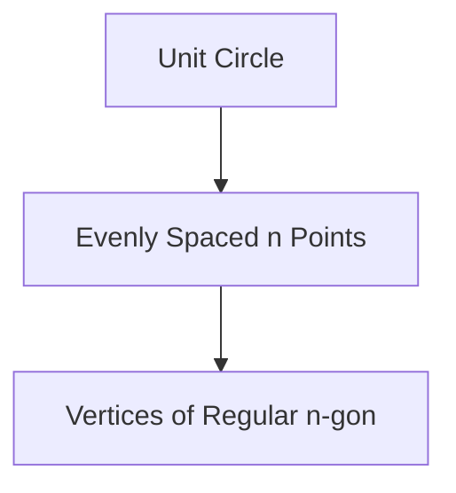

# 1.7 Powers and Roots of Complex Numbers

## Objectives
- Apply De Moivre’s Theorem to compute powers efficiently.
- Determine all $n$th roots of a complex number.
- Visualize root distribution as equally spaced points on a circle.
- Use roots of unity for factorization / simplification.

## Prerequisites
- Polar form (Lesson 1.6).
- Euler representation $re^{i\theta}$.

## Core Definitions & Formulas
| Concept | Formula |
|---------|---------|
| De Moivre | $(r \text{cis}\,\theta)^{n} = r^{n} \text{cis}\,(n\theta)$ |
| Roots of w | If $w=R\text{cis}\,\Phi$, then $z_k = R^{1/n} \text{cis}\,\left(\frac{\Phi+2\pi k}{n}\right)$, $k=0,\dots,n-1$ |
| Roots of Unity | $\omega_k = e^{2\pi i k / n}$ |
| Unity Factorization | $x^{n}-1 = \prod_{k=0}^{n-1} (x-\omega_k)$ |

## Derivations / Proof Sketches
### De Moivre
From $re^{i\theta}$ form: $(re^{i\theta})^{n} = r^{n} e^{i n \theta}$, then convert back to cis.

### Roots Spacing
Angle increments by $2\pi/n$ so arguments: $\Phi/n, (\Phi+2\pi)/n, \dots$ form arithmetic progression modulo $2\pi$.

## Visual Intuition
### Roots of Unity Distribution


### Modulus & Angle (Chart Placeholder Magnitudes)
```chart
{
	"type":"bar",
	"data":{
		"labels":["k=0","k=1","k=2","k=3"],
		"datasets":[{"label":"|z_k| (4th roots of 16)","data":[2,2,2,2],"backgroundColor":"rgba(233,30,99,0.5)"}]
	},
	"options":{"plugins":{"title":{"display":true,"text":"Equal Moduli for Roots"}}}
}
```

### Explore Roots (Desmos)
```desmos
// 5th roots of 1
n=5
// Points conceptually at angle 2πk/n
```

## Worked Examples
### Example 1: Power via De Moivre
Compute $(\cos 20^{\circ}+ i \sin 20^{\circ})^{9}$ = $\cos 180^{\circ}+ i \sin 180^{\circ} = -1$.

### Example 2: Cube Roots of Unity
Solutions to $z^{3}=1$: $z_k = \text{cis}\,(2\pi k/3)$ for $k=0,1,2$: $1$, $-1/2 + i\sqrt{3}/2$, $-1/2 - i\sqrt{3}/2$.

### Example 3: 4th Roots of $16$
$16 = 16 \text{cis}\,0$; $R=16$, $R^{1/4}=2$. Roots: $2\text{cis}\,(\pi k/2)$: $2, 2i, -2, -2i$.

### Example 4: Solve $z^{5} = -32$
Write $-32=32 \text{cis}\,\pi$. Modulus root: $32^{1/5}=2$. Roots: $z_k = 2 \text{cis}\,( (\pi+2\pi k)/5 )$, $k=0,...,4$.

### Example 5: Factorization Using Roots of Unity
$x^{4}-1=(x^{2}-1)(x^{2}+1)=(x-1)(x+1)(x-i)(x+i)$ (roots = 4th roots of unity not equal to 0th repetition).

## Common Mistakes & Tips
- Forgetting to list all $n$ distinct values (stop at $n-1$).
- Confusing argument scaling for roots (divide, not multiply by $n$).
- Neglecting principal argument normalization.
- Overlooking that roots lie on a circle of radius $R^{1/n}$.

## Practice Set
### Core
1. Compute $(\cos 45^{\circ}+i\sin 45^{\circ})^{4}$.
2. Find all cube roots of $8$.
3. Find modulus of each 6th root of $64$.
4. Write 5th roots of unity explicitly.
5. Determine $z$ if $z^{4}=81$.

### Challenge
6. Express $x^{5}-1$ as product of linear factors over $\mathbb{C}$.
7. Simplify $(1+i)^{8}$.
8. Solve $z^{6}= -64$.
9. Show product of nth roots of unity equals $(-1)^{n-1}$.

### Extension
10. Prove geometric mean of moduli of roots of $z^{n}=w$ equals $R^{1/n}$.
11. Show sum of all nth roots of unity is 0 (use geometric series identity).
12. Use roots of unity to evaluate $\sum_{k=0}^{n-1} \cos(2\pi k/n)=0$.

<details>
<summary>Markscheme (Core)</summary>

---
1. $ (\sqrt{2}/2 + i \sqrt{2}/2)^4= (e^{i\pi/4})^{4}= e^{i\pi}= -1$.
2. $8=8\text{cis}0$ roots: $2\text{cis}(2\pi k/3)$.
3. $64=64\text{cis}0$ ⇒ modulus roots $=64^{1/6}=2$.
4. $e^{2\pi i k/5}$ for $k=0..4$.
5. $81=3^{4}$ ⇒ roots $3\text{cis}(\pi k/2)$.

</details>

<details>
<summary>Markscheme (Challenge)</summary>

---
6. $x^{5}-1= \prod_{k=0}^{4} (x-e^{2\pi i k/5})$.
7. $(1+i)=\sqrt{2} e^{i\pi/4}$ ⇒ $(\sqrt{2})^{8} e^{i2\pi}= (2^{4})=16$.
8. $-64=64 \text{cis}\,\pi$ roots: $2 \text{cis}((\pi+2\pi k)/6)$.
9. Coefficients of monic polynomial $x^{n}-1$ ⇒ product = constant term * (-1)^{n} = (-1)^{n}(-1)=(-1)^{n-1}$.

</details>

<details>
<summary>Markscheme (Extension)</summary>

---
10. All moduli equal $R^{1/n}$ so geometric mean equals that value.
11. Sum is geometric series $(1-\omega^{n})/(1-\omega)=0$ for primitive root $\omega\ne1$.
12. Real part of sum of roots of unity (excluding 0 frequency) zero.

</details>

## Applications / Modelling
- Signal processing (roots of unity in DFT).
- Symmetry/rotations in geometry.
- Polynomial factorization.

## Extension / HL Enrichment
- Introduce primitive roots of unity and cyclotomic polynomials.
- Explore locus of $z^{n}=w$ as multi-valued function (Riemann surface preview).

## Summary & Key Takeaways
- De Moivre: powers multiply angle, power modulus.
- Roots evenly spaced on circle.
- Roots of unity underpin many algebraic identities.

## Quick Reference
| Task | Procedure |
|------|-----------|
| Power | $(r,\theta) \mapsto (r^{n}, n\theta)$ |
| Root | $(R,\Phi) \mapsto (R^{1/n}, (\Phi+2\pi k)/n)$ |

## Metadata
Topic Code: M1.7  
Level: HL  
Tags: complex, De Moivre, roots, powers, unity  
Dependencies: polar form  

