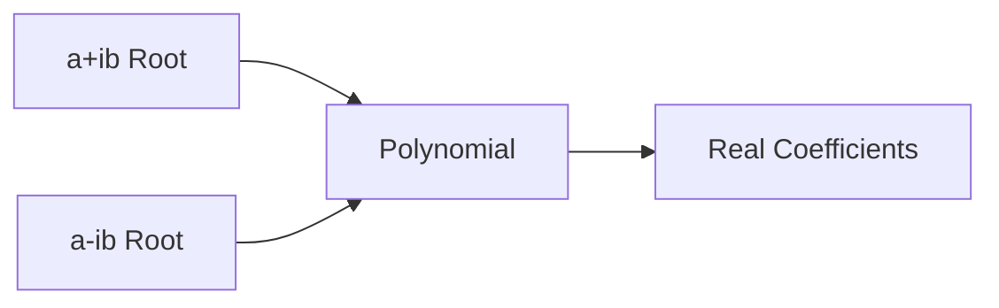

# 1.8 Conjugate Roots of Real-Coefficient Polynomials

## Objectives
- State and apply the Conjugate Root Theorem.
- Construct real quadratic factors from complex conjugate pairs.
- Factor real polynomials using one non-real root.
- Understand why real coefficients force conjugate symmetry.

## Prerequisites
- Complex basics (1.5–1.7).
- Polynomial evaluation.

## Core Theorem
If $p(x)$ has real coefficients and $p(a+ib)=0$ (with $b\ne 0$), then $p(a-ib)=0$.

## Proof Sketch
Let $p(x)=c_n x^{n}+\dots+c_0$ with all $c_k \in \mathbb{R}$. Then $0=p(a+ib)$ implies $0=\overline{p(a+ib)} = p(\overline{a+ib}) = p(a-ib)$ using conjugation distributing over sums/products.

## Quadratic Factor Construction
Given root $z=a+ib$ ($b\ne0$), the minimal real factor is $(x-(a+ib))(x-(a-ib)) = (x-a)^2 + b^{2}$.

## Visual Intuition
### Conjugate Symmetry


### Example Coeff Magnitudes
```chart
{
	"type":"bar",
	"data":{
		"labels":["x^2","x","const"],
		"datasets":[{"label":"Coefficients of x^2 -2x +5","data":[1,-2,5],"backgroundColor":"rgba(33,150,243,0.5)"}]
	},
	"options":{"plugins":{"title":{"display":true,"text":"Quadratic from Conjugate Pair (1±2i)"}}}
}
```

## Worked Examples
### Example 1: Construct Factor
Root $3+4i$ given ⇒ factor: $(x-3)^2+4^{2}=x^{2}-6x+25$.

### Example 2: Factorization
Given roots $2$ and $1+2i$ of cubic with real coefficients. Third root must be $1-2i$. Polynomial: $(x-2)((x-1)^2+4)= (x-2)(x^{2}-2x+5)$.

### Example 3: Recover Polynomial from One Non-Real Root
Given monic quartic has roots $1+ i$, $2$, and $-3$. Remaining root must be $1 - i$. Polynomial: $(x-2)(x+3)((x-1)^2+1)$.

## Common Mistakes & Tips
- Forgetting to include conjugate leads to non-real coefficients.
- Arithmetic sign errors expanding $(x-a)^2 + b^2$.
- Assuming converse incorrectly: complex roots might still have real coefficients even if not recognized.

## Practice Set
### Core
1. Given root $4-3i$, write real quadratic factor.
2. Factor monic quadratic with roots $2\pm5i$.
3. Polynomial has real coefficients and root $-1+ i$. Give conjugate root and quadratic factor.

### Challenge
4. Monic cubic with roots $2+ i$, $2- i$, and $-4$: write polynomial.
5. Show product $(x-(a+ib))(x-(a-ib))$ has discriminant $\Delta = (-2a)^2 - 4(a^{2}+b^{2}) = -4b^{2}<0$.
6. Given monic quartic with real coefficients has factor $x^{2}-6x+13$, list its two complex roots.

### Extension
7. Prove: if coefficients are rational and a non-real root is $p+qi$ with rationals $p,q$, its conjugate also appears (follows from real case but highlight rational closure).
8. Discuss implications for irreducibility over $\mathbb{R}$ vs $\mathbb{C}$ (quadratic factors only).

<details>
<summary>Markscheme (Core)</summary>

---
1. $(x-4)^2+3^{2}=x^{2}-8x+25$.
2. $x^{2}-4x+29$.
3. Conjugate $-1 - i$; factor $(x+1)^2+1=x^{2}+2x+2$.

</details>

<details>
<summary>Markscheme (Challenge)</summary>

---
4. $(x+4)((x-2)^2+1)=(x+4)(x^{2}-4x+5)$.
5. Discriminant negative ⇒ no real roots, so irreducible over $\mathbb{R}$.
6. Solve $x^{2}-6x+13=0$ ⇒ $x=3\pm2i$.

</details>

<details>
<summary>Markscheme (Extension)</summary>

---
7. Real coefficient argument specialized to rationals.
8. Fundamental Theorem of Algebra: over $\mathbb{R}$ factors into linear/quadratic.

</details>

## Applications / Modelling
- Ensuring polynomial factorization stays in $\mathbb{R}[x]$.
- Stability analysis (complex conjugate eigenvalues in systems produce oscillations).

## Extension / HL Enrichment
- Link with complex conjugate eigenvalues of real matrices.
- Explore how discriminant sign ensures non-real pair.

## Summary & Key Takeaways
- Non-real roots of real polynomials occur in conjugate pairs.
- Quadratic from pair always has negative discriminant.

## Quick Reference
| Given Root | Real Quadratic |
|------------|----------------|
| $a+ib$ | $(x-a)^2 + b^{2}$ |

## Metadata
Topic Code: M1.8  
Level: HL  
Tags: polynomials, complex, conjugate roots, factorization  
Dependencies: complex numbers  

