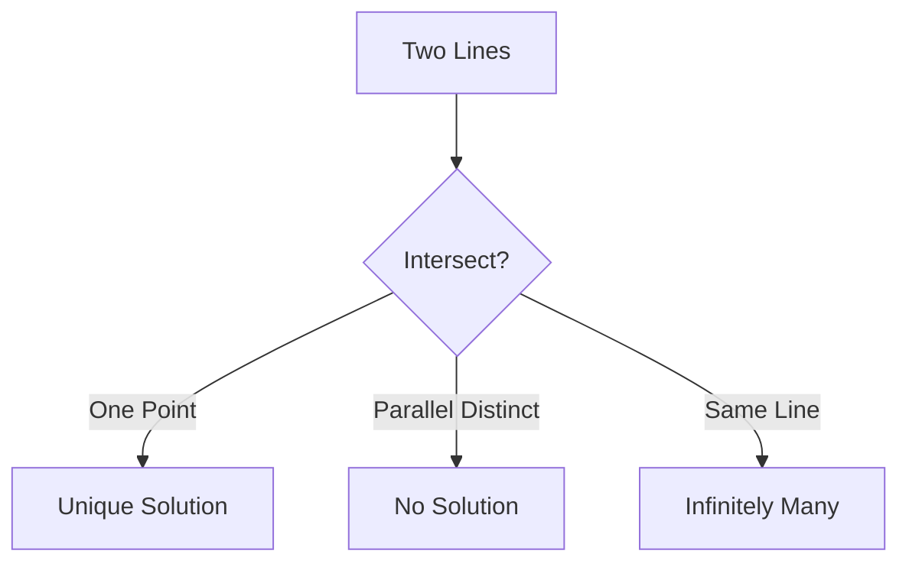

# 1.9 Systems of Linear Equations (Up to 3×3)

## Objectives
- Solve 2×2 and 3×3 linear systems using substitution, elimination, and Gaussian elimination.
- Classify systems: unique solution, infinitely many, or inconsistent.
- Use determinant (2×2 / 3×3) as a quick uniqueness test (non-zero ⇒ unique).
- Formulate systems from word problems / modelling contexts.

## Prerequisites
- Algebraic manipulation.
- Matrix notation helpful (not mandatory initially).

## Concept Overview
A linear system represents intersection of lines (2D) or planes (3D). Determinant non-zero means independent equations (unique point). Zero determinant requires deeper consistency inspection (are planes coincident or parallel?).

## Methods Overview
| Method | Idea | Pros | Cons |
|--------|------|------|------|
| Substitution | Solve one eq for variable, substitute | Simple small systems | Messy with fractions |
| Elimination | Combine equations to remove variables | Structured & scalable | Careful arithmetic |
| Gaussian Elimination | Systematic row operations to echelon form | Algorithmic, extendable | More notation |
| Determinant / Cramer's (2×2,3×3) | Ratio of determinants | Direct formula | Fails if det=0; arithmetic heavy |

## Determinant Quick Tests
| System | Determinant | Conclusion |
|--------|------------|------------|
| 2×2 $\begin{vmatrix} a & b \\ c & d \end{vmatrix}=ad-bc$ | $\ne 0$ | Unique solution |
| 3×3 (non-zero) | $\ne 0$ | Unique solution |
| Any size | $=0$ | Need rank analysis |

## Derivations / Notes
### Cramer's Rule (2×2)
For $ax+by=e$, $cx+dy=f$ with $\Delta=ad-bc\ne0$:
$$x=\frac{\begin{vmatrix} e & b \\ f & d \end{vmatrix}}{\Delta}, \quad y=\frac{\begin{vmatrix} a & e \\ c & f \end{vmatrix}}{\Delta}.$$

### Gaussian Elimination Skeleton
1. Form augmented matrix.
2. Use row operations to reach upper triangular (row echelon) form.
3. Back-substitute.

## Visual Intuition
### 2D Cases


### Determinant as Area (2×2)
```chart
{
	"type":"bar",
	"data":{
		"labels":["Parallelogram Area"],
		"datasets":[{"label":"|ad-bc|","data":[6],"backgroundColor":"rgba(76,175,80,0.6)"}]
	},
	"options":{"plugins":{"title":{"display":true,"text":"Geometric Meaning of 2×2 Determinant"}}}
}
```

### Exploring Plane Intersections (Desmos Placeholder)
```desmos
// 3D visualization not rendered here, conceptual only
// Three planes: unique intersection vs parallel vs coincident
```

## Worked Examples
### Example 1: 2×2 Elimination
$\begin{cases}2x+3y=7 \\ 4x - y = 5 \end{cases}$ Multiply first eq by 2: $4x+6y=14$. Subtract second: $7y=9$ ⇒ $y=9/7$, back-substitute: $2x+27/7=7$ ⇒ $2x=22/7$ ⇒ $x=11/7$.

### Example 2: 3×3 System (Gaussian)
$\begin{cases} x+ y+ z=6 \\ 2x - y + 3z=14 \\ -x+2y+2z=2 \end{cases}$ → Augmented matrix and eliminate (omitted detail) ⇒ solution $(x,y,z)=(2,1,3)$.

### Example 3: Consistency Check
System: $x+2y=4$, $2x+4y=8$, $3x+6y=12$ ⇒ All multiples → infinite solutions (one degree of freedom). Param: $y=t$, $x=4-2t$.

### Example 4: No Solution
Lines: $x+2y=3$, $2x+4y=10$ inconsistent: second would require dividing by 2 gives $x+2y=5$ conflicting with first.

### Example 5: Determinant Unique Test
$\begin{vmatrix}1 & 2 \\ 3 & 4 \end{vmatrix}= -2 \ne 0$ ⇒ invertible ⇒ unique solution.

## Common Mistakes & Tips
- Arithmetic slips in elimination (track signs carefully).
- Declaring no solution too early—reduce fully first.
- Forgetting to parameterize infinite solution sets.
- Misusing determinant zero as automatic inconsistency (needs rank check).

## Practice Set
### Core
1. Solve $\begin{cases}3x+2y=11 \\ x - y =1 \end{cases}$.
2. Solve $\begin{cases} x+ y+ z=4 \\ x+2y - z=1 \\ 2x - y +2z=7 \end{cases}$.
3. Classify: $2x+4y=8$, $x+2y=4$.
4. Use determinant: $\begin{cases}5x+2y=3 \\ 10x+4y=6 \end{cases}$.
5. Form system from: “Sum of two numbers 23; difference 5.” Solve.

### Challenge
6. Solve via elimination: $\begin{cases} 2x - y + z = 3 \\ 4x + y - z = 5 \\ -2x + 3y + 2z = 4 \end{cases}$.
7. Parameterize solution of $x+2y-3z=0$, $2x+4y-6z=0$.
8. Determine $k$ so system has infinitely many solutions: $x+ky=2$, $2x+4y=5$.
9. Explain why determinant test fails to classify infinite vs none when zero.

### Extension
10. Show if two equations of 3×3 system are multiples, rank deficiency arises.
11. Relate determinant to area/volume scaling for linear transformation viewpoint.
12. Derive inverse of 2×2 to solve system quickly.

<details>
<summary>Markscheme (Core)</summary>

---
1. From second: $x=1+y$. Substitute: $3(1+y)+2y=11$ ⇒ $3+5y=11$ ⇒ $y=8/5$, $x=13/5$.
2. Solve (row ops) ⇒ $(x,y,z)=(2,1,1)$ (students show steps).
3. Infinite solutions (dependent equations).
4. Determinant zero; second eq multiple; consistent ⇒ infinite solutions.
5. $x+y=23$, $x-y=5$ ⇒ add: $2x=28$ ⇒ $x=14$, $y=9$.

</details>

<details>
<summary>Markscheme (Challenge)</summary>

---
6. Solution $(x,y,z)=(1,1,0)$.
7. Equations identical ⇒ free variables: let $z=t$, $y=s$, then $x= -2s+3t$.
8. Need consistency when substituting: From first $x=2-ky$; into second $2(2-ky)+4y=5$ ⇒ $4 -2ky +4y=5$ ⇒ $4y(1- k/2)=1$ choose $k=2$ for denominator vanish and check consistency? Re-evaluate: For infinite solutions both eq become dependent: require $[1\ k | 2]$ proportional to $[2\ 4 |5]$ ⇒ ratios $2:4 :5$ vs $1:k:2$ inconsistent; no $k$ works (so none). (Teaching point.)
9. Determinant zero ambiguous: could be infinite or none depending on augmented rank.

</details>

<details>
<summary>Markscheme (Extension)</summary>

---
10. Rank < variable count ⇒ at least one free variable or inconsistency.
11. Determinant magnitude equals area (2D)/volume (3D) scaling factor.
12. Inverse of $\begin{pmatrix} a & b \\ c & d \end{pmatrix}$ is $\frac{1}{ad-bc}\begin{pmatrix} d & -b \\ -c & a \end{pmatrix}$.

</details>

## Applications / Modelling
- Physics: equilibrium force balances.
- Finance: blend constraints (portfolio weights).
- Chemistry: balancing reaction equations (extended integer methods).

## Extension / HL Enrichment
- Rank-nullity preview (dimension concepts).
- Condition number / sensitivity (numerical stability).

## Summary & Key Takeaways
- Non-zero determinant ⇒ unique solution.
- Zero determinant requires rank/consistency check.
- System classification: unique / infinite / none.

## Quick Reference
| Case | Condition | Outcome |
|------|-----------|---------|
| det≠0 | Full rank | Unique |
| det=0, consistent | Rank < vars | Infinite |
| det=0, inconsistent | Contradiction row | None |

## Metadata
Topic Code: M1.9  
Level: SL/HL  
Tags: linear systems, elimination, determinant, Gaussian  
Dependencies: algebra  

